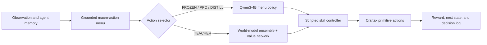

# LLM Priors vs. Learned World Models in Craftax

## Executive summary

This project asks a practical agent-learning question:

> **With only 3,200 environment decisions, how do a pretrained LLM, PPO fine-tuning, and a learned world-model planner differ in what they learn? Can policy distillation combine their complementary strengths?**

I built one Craftax harness in which every system chooses from the same grounded menu of variable-duration macro-actions. I then compared:

| System | Learning signal | Training interactions | Main role |
|---|---|---:|---|
| **FROZEN** | Pretrained Qwen3-4B prior only | 0 | Behavioral reference |
| **PPO** | Semi-Markov PPO with GAE | 3,200 | Standard model-free RL baseline |
| **TEACHER** | Structured one-step world model, value network, and planning | 3,200 | Model-based learner with no LLM prior |
| **DISTILL** | Supervised distillation of the teacher into Qwen3-4B | Inherits 3,600 teacher interactions; no new interactions | Fast deployable policy |

The primary matched-interaction comparison is **PPO versus TEACHER**. FROZEN is a no-training reference. DISTILL is reported separately because it inherits the teacher's data after an additional 400-decision dungeon adaptation stage.

### Main dev-set results

On 60 paired surface worlds:

| System | Reward | Achievements | Survival |
|---|---:|---:|---:|
| **TEACHER** | **10.61** | **10.6** | **90%** |
| PPO | 7.66 | 8.5 | 52% |
| FROZEN | 7.29 | 8.1 | 48% |

The TEACHER exceeded FROZEN by **+3.32 reward** under paired evaluation ($p<0.001$). A second independently initialized teacher reproduced the result with **11.75 reward and 90% survival**. PPO showed **no detectable improvement** over FROZEN under the same 3,200-decision training budget ($+0.36$, $p=0.22$).

The systems learned different things:

- The pretrained LLM already knew the long wood $\rightarrow$ stone $\rightarrow$ iron progression chain, but almost never drank water and often died of dehydration.
- The world-model planner learned Craftax-specific survival mechanics and broad surface behavior, but did not discover the long chain to iron under the same interaction budget.
- After 400 floor-1 decisions, the world-model planner improved from **4.81 to 13.46 reward**, while the PPO policy improved from **4.93 to 5.60**, a change the current evaluation could not resolve statistically.
- Distillation transferred the teacher's survival behavior into Qwen3-4B with no new environment interactions: **9.75 reward, 53/60 survival, and zero dehydration deaths**. It also exposed a real tradeoff: the student spent more decisions on upkeep, reached iron less often, and imported one unsafe dungeon sleeping habit.

The central conclusion is not simply that one system is always better. It is that **pretrained semantic knowledge and environment-grounded model learning produce complementary competence and complementary failure modes**.

---

## 1. Problem and testbed

Craftax is a procedurally generated survival game with a Minecraft-like technology tree, health and survival meters, hostile creatures, one-time achievements, and a dungeon spanning nine floors. It is useful for this study because some mechanics resemble concepts represented in an LLM's pretraining data, while others are specific to Craftax.

Examples:

- The wood $\rightarrow$ stone $\rightarrow$ iron crafting chain resembles Minecraft and is familiar to the pretrained LLM.
- Craftax has a thirst meter, while Minecraft does not.
- Dungeon survival changes the value of behaviors that are safe on the surface, such as sleeping when energy is low.

The project therefore tests two different sources of competence:

1. **A broad prior:** use a pretrained LLM to rank plausible actions.
2. **Task-specific experience:** learn action outcomes from Craftax interactions and plan using those predictions.

The current work is the first stage of a larger long-horizon RL program. The same environment supports saved-state curricula, exact branching from simulator snapshots, deeper-floor training, and a future counterfactual credit-assignment study.

---

## 2. Shared agent interface

All systems operate through the same hierarchy:



At each decision, the harness constructs up to 20 feasible macro-actions such as:

```text
go_to(tree)
craft(stone_pickaxe)
fight(zombie)
drink_water
open_chest
descend
```

A scripted controller executes the selected macro-action over one or more primitive game steps.

### The action-menu contract

The menu follows two invariants:

1. **Offered means executable.** The menu does not offer a craft without the required materials or sleep when energy is full.
2. **Availability is not value.** A visible chest may generate `open_chest`, but the menu does not tell the policy whether opening it is useful.

The constructor uses only information the agent has observed, never the hidden game map. Its grounding predicates are shared with the executor, so action availability and execution cannot silently drift apart.

This interface is an important part of the study. It reduces the LLM's job from unconstrained text generation to ranking grounded high-level actions, while preserving strategic decisions such as whether to fight, explore, craft, rest, or descend.

### Semi-Markov time accounting

Macro-actions have different durations. A short fight may take three game steps; navigation may take forty. Discounting once per planner decision would make slow actions artificially cheap.

The project therefore treats the planner as a semi-Markov decision process. If macro-action $t$ lasts $\tau_t$ primitive steps, its reward is

$$
R_t^{\mathrm{macro}}=\sum_{j=0}^{\tau_t-1}\gamma^j r_{t,j}.
$$

Returns, GAE, the value network, and world-model action values all use elapsed primitive time. The implementation is shared across systems and tested against hand-calculated trajectories.

---

## 3. The four systems

### 3.1 FROZEN: pretrained prior without learning

Qwen3-4B scores every action string in the current menu. For action $a$ with tokens $y_{1:L}$, the score is its length-normalized mean token log-probability:

$$
s_\theta(h,a)=\frac{1}{L}\sum_{j=1}^{L}\log p_\theta()
$$

The scores are divided by a calibrated temperature and normalized across the menu to form a categorical policy. Length normalization prevents a short action such as `sleep()` from receiving an artificial advantage over a longer serialization such as `mine(resource=wood, count=1)`.

FROZEN is never updated. It measures what the pretrained LLM already knows.

### 3.2 PPO: model-free LLM post-training

The PPO arm starts from the same Qwen3-4B policy and trains LoRA adapters with duration-aware PPO and GAE.

The GAE recurrence is

$$
\delta_t=R_t^{\mathrm{macro}}+\gamma^{\tau_t}(1-d_t)V(h_{t+1})-V(h_t),
$$

$$
\widehat A_t=\delta_t+\gamma^{\tau_t}\lambda(1-d_t)\widehat A_{t+1}.
$$

The policy is the categorical distribution over the complete menu. PPO therefore uses one scalar probability ratio per macro-decision, not independent token-level ratios:

$$
\rho_t=\frac{\mu_{\mathrm{new}}(a_t\mid h_t)}{\mu_{\mathrm{old}}(a_t\mid h_t)},
$$

where $\mu$ includes the same $\varepsilon=0.05$ exploration mixture used during collection. The clipped surrogate is applied to this decision-level ratio, and further optimizer steps stop when the menu-policy KL crosses the configured threshold.

### 3.3 TEACHER: structured model-based planning

The TEACHER contains no LLM and starts from randomly initialized neural networks. It is not structure-free: it uses the same grounded action menu, typed observable state, and known achievement-reward decomposition as the other systems.

Its one-step world model predicts

$$
M_\psi(x_t,a_t)\rightarrow\left(\widehat x_{t+1},\widehat r_t,\widehat\tau_t,\widehat d_t,\widehat y_t\right).
$$

The 132-dimensional state includes survival meters, inventory and equipment, the full set of already-unlocked achievements, visible entities, exploration status, floor information, and the previous action outcome. Typed output heads separately model continuous values, counts, binary events, categorical variables, duration, and death.

A separate value network estimates continuation value. Each member of a three-model bootstrap ensemble scores an action as

$$
Q_m(h,a)=\widehat r_m(h,a)+\gamma^{\max(\widehat\tau_m,1)}\left(1-\widehat d_m(h,a)\right)V_\omega(\widehat x'_m).
$$

During data collection, one ensemble member is sampled for the full episode, producing coherent Thompson-style exploration. During evaluation, the planner uses a pessimistic score:

$$
S_{\mathrm{eval}}(h,a)=\mu_Q(h,a)-0.5U(h,a),
$$

where $U$ is ensemble disagreement.

The model is retrained in eight rounds of 400 decisions each. Because the networks are small, the full training loop runs in CPU minutes.

### 3.4 DISTILL: transfer planning behavior into the LLM

The teacher's logged states already contain a menu and a score for every action. These become supervised policy targets for Qwen3-4B, requiring no new environment interactions.

The teacher distribution is regularized toward the base LLM prior:

$$
q^*(a\mid h)\propto\pi_{\mathrm{base}}(a\mid h)\exp\left(\frac{S_{\mathrm{teacher}}(h,a)}{\beta}\right).
$$

A confidence gate suppresses uncertain teacher labels, while a KL anchor protects the base policy where the teacher has weak evidence. Survival actions receive a targeted exception because the base LLM assigns almost no probability to drinking, making multiplicative prior regularization unable to teach that behavior.

The goal is not merely imitation. It is to test whether a single fast LLM policy can retain the prior's deep crafting knowledge while absorbing the teacher's learned survival behavior.

---

## 4. Experimental design

### Matched conditions

The main PPO-versus-TEACHER comparison holds fixed:

- 3,200 real macro-decisions for training;
- the grounded action interface and controller;
- the exploration floor during collection;
- the evaluation worlds and evaluation code;
- the native Craftax objective;
- semi-Markov discounting.

The comparison does **not** hold fixed starting knowledge or computation:

- PPO starts from a 4B pretrained LLM and uses GPU training.
- TEACHER starts from random weights, uses an engineered structured model, and trains on CPU.

That asymmetry is part of the research question: how do prior knowledge and task-specific model learning trade off under a small real-interaction budget?

### Statistical evaluation

Headline surface results use 60 paired development worlds. Each system plays the same seeds; differences are computed world by world. Confidence intervals and $p$-values use a paired bootstrap with 10,000 resamples.

The evaluator also reports the minimum detectable effect at 80% power. When a difference is below that threshold, the report says the evaluation cannot resolve the systems rather than claiming they are equal.

A separate set of 80 test worlds remains untouched.

---

## 5. Results

### 5.1 Surface performance under the matched interaction budget

| System | Reward | Achievements | Survival | Difference from FROZEN |
|---|---:|---:|---:|---:|
| **TEACHER** | **10.61** | **10.6** | **90%** | **+3.32 reward, $p<0.001$** |
| PPO | 7.66 | 8.5 | 52% | +0.36 reward, $p=0.22$ |
| FROZEN | 7.29 | 8.1 | 48% | — |

The randomly initialized structured planner outperformed the frozen 4B LLM on reward, achievement count, and survival after 3,200 interactions. The result replicated with a second teacher seed, which reached 11.75 reward, 11.9 achievements, and 90% survival.

The PPO run produced no detectable improvement over FROZEN at this budget. This should be read narrowly: it is a result for this policy representation, implementation, task, and interaction budget, not a claim that PPO is generally ineffective.

### 5.2 What made the world-model planner work

The final teacher emerged from a sequence of measured changes:

| Version | Main change | Reward |
|---|---|---:|
| Initial structured planner | Correct grounded menu, naive reward prediction | 5.75 |
| + exploration floor | $\varepsilon=0.05$ action diversity | 9.41 |
| + exact one-time reward masking | Per-achievement prediction | 7.35 |
| + alternative value targets | Model-max backup | 7.50 |
| **+ rare-event shrinkage** | Blend sparse heads with a pooled prior | **10.61** |

Two findings were especially important.

**First, coverage dominated early performance.** Before adding a small exploration floor, the dataset barely contained coal, smelting, or combat. The model could not value outcomes it had never observed.

**Second, a more faithful reward model initially hurt.** Independent per-achievement heads predicted near-zero for rare outcomes, causing the planner to avoid those outcomes and preventing new data from arriving. A shrinkage estimator fixed the feedback loop by blending sparse achievement predictions with an easier pooled "any achievement" estimate. As evidence accumulated, the pooled contribution automatically decreased.

This is a system-level bias-variance result: a sharper model was less useful when its data coverage was poor.

### 5.3 The prior and the learned model encode complementary knowledge

| Behavior | FROZEN / PPO | TEACHER |
|---|---|---|
| Long wood $\rightarrow$ stone $\rightarrow$ iron chain | Strong; iron in 14/60 worlds | Not discovered |
| Drinking and thirst management | Almost absent | Learned; 90% survival |
| Breadth over early achievements | Partial | Strongest |

The LLM's prior gives it a long-horizon crafting plan that the experience-only teacher does not discover under 3,200 decisions. The teacher instead learns local, task-specific mechanics that contradict or fall outside the LLM's pretraining prior.

This complementarity motivates the distillation study.

### 5.4 Near-zero-shot transfer to floor 1

The three systems were evaluated from 40 saved floor-1 entry states. Prior floor-1 exposure was very small but not exactly zero: 3 decisions for TEACHER, 13 for PPO, and none for FROZEN.

| System | Reward | Achievements | Survived |
|---|---:|---:|---:|
| TEACHER | 4.81 | **3.20** | 18/40 |
| PPO | 4.93 | 2.43 | 28/40 |
| FROZEN | 3.98 | 1.93 | **29/40** |

The reward differences were not statistically resolved at 40 worlds. The failure modes were more informative:

- On the surface, the LLMs often died because their prior did not represent Craftax's thirst mechanic.
- On floor 1, the teacher often died because it transferred a surface habit—sleep when energy is low—into a dangerous dungeon where sleeping increases exposure to monsters.

The system trained from experience failed under distribution shift in a different way from the system trained from broad prior knowledge.

### 5.5 Floor-1 adaptation with 400 additional decisions

Each learning system received 400 additional floor-1 decisions and then used its native update procedure. These results are reported separately from the 3,200-decision table.

| System | Before | After | Change |
|---|---:|---:|---:|
| **TEACHER** | 4.81 | **13.46** | **+8.65, $p<0.001$** |
| PPO | 4.93 | 5.60 | +0.68, not resolved |

The adapted teacher reduced deaths from 22 to 8 and learned floor-specific behavior involving chests, coal, furnaces, torches, bows, potions, iron, and diamond. Its sleep policy also became conditional rather than simply disappearing: deaths per sleep fell from 34% to 5%.

PPO collected useful floor-1 experience and produced sensible advantages, but the observed policy improvement remained small. Disabling the KL early stop did not produce a measurable gain, suggesting that early stopping alone did not explain the gap.

The safe conclusion is:

> **Under this adaptation protocol, the model-based system converted the 400-decision dataset into substantially larger behavioral change than the PPO system.**

This experiment does not isolate a universal cause. The algorithms differ in representation, data reuse, optimization, and planning. In addition, adaptation and evaluation used the same set of floor-entry worlds, so this is evidence of rapid within-distribution adaptation, not yet held-out floor-1 generalization.

### 5.6 Distillation combines knowledge, but imperfectly

The reported distillation run used the dungeon-adapted teacher's 3,600-decision log and added no new environment interactions.

| Metric | FROZEN | TEACHER | DISTILL |
|---|---:|---:|---:|
| Surface reward | 7.29 | 10.61 | **9.75** |
| Surface survival | 29/60 | 54/60 | **53/60** |
| Dehydration deaths | 29 | 0 | **0** |
| Iron worlds | 14 | 0 | **8** |

Relative to FROZEN, DISTILL improved reward by +2.46, achievements by +1.97, and survival by 40 percentage points, all with $p<0.001$ on the development worlds. The current evaluation did not resolve a difference between DISTILL and its teacher on aggregate surface metrics.

The student learned the teacher's survival behavior, including well-timed drinking, while retaining part of the LLM's crafting depth. The transfer was not free:

- 27.7% of decisions went to upkeep, leaving fewer turns for the long iron chain.
- A risky dungeon sleeping habit was partially imported.
- The base-prior trust region completely blocked `place`, so a teacher behavior worth roughly one achievement per world did not transfer.

A follow-up evidence-weighted trust region recovered placing and removed dungeon sleeping, but over-allocated probability to placing. Because menu probabilities form a fixed budget, the gain crowded out drinking and deep crafting. The experiment was retained as a negative result rather than promoted to the final system.

The distillation result therefore supports a nuanced conclusion:

> **A single LLM policy can absorb substantial environment-specific behavior from a model-based teacher, but preserving prior competence requires controlling both what transfers and how much probability mass each transferred behavior receives.**

---

## 6. Engineering and measurement lessons

A large part of the project was making the comparison trustworthy.

### 6.1 Audit what the interaction budget actually purchased

An early teacher spent 61% of its training decisions on actions that consumed zero game steps. Another version spent roughly 30% on impossible crafts. These failures looked like algorithmic weakness but were action-interface defects.

### 6.2 Share rules instead of copying them

Action availability and execution now call the same grounding functions. Death handling, which Craftax reports one step late, was also centralized after one missing copy wrote 81 post-death decisions into a training log.

### 6.3 Test gradients, not only forward values

The batched LLM candidate scorer has a plausible failure mode that produces correct scores but incorrect gradients. The test suite constructs that broken path explicitly and verifies that the real implementation differs from it.

### 6.4 Measure evaluation power

Early ten-world experiments had a minimum detectable reward effect larger than most real effects in the project. Several apparent findings disappeared at 60 paired worlds. The final evaluator reports both significance and detectable effect size.

### 6.5 Track policy probabilities across inference and training stacks

vLLM collects rollouts, while Hugging Face/PyTorch computes gradients. Identical weights do not produce identical scores across these stacks. The training code recomputes old menu probabilities in the training stack to preserve the PPO anchor $\rho(\theta_{\mathrm{old}})=1$, logs the serving/training discrepancy, and treats the remaining behavior-probability mismatch as a limitation rather than hiding it.

---

## 7. Limitations

1. **Development results only.** The final 80-world test set has not been used.
2. **Limited training seeds.** The teacher has two independent seeds; PPO and distillation currently have one each.
3. **Structured prior in the teacher.** The teacher has random neural weights but uses an engineered state representation, a grounded action menu, typed heads, and the known achievement-reward decomposition. It should not be described as learning without any domain structure.
4. **The action hierarchy does substantial work.** This is a study of strategic learning over grounded macro-actions, not raw-pixel or raw-token control.
5. **Surface-focused training.** Full multi-floor training has not yet begun.
6. **Floor-1 adaptation is not a held-out-state generalization test.** Adaptation and evaluation use the same entry-world distribution; a clean split is a planned follow-up.
7. **One environment and one model size.** The findings should be treated as results for this setup and hypotheses elsewhere.
8. **PPO is an implementation-specific baseline.** The negative result should not be generalized beyond the current policy representation, budget, and training setup.
9. **Serving/training policy mismatch remains measurable.** Recomputing probabilities removes false gradient drift but does not make the Hugging Face distribution identical to the vLLM behavior distribution.

---

## 8. Next steps

1. **Run the untouched test set once** after freezing the report and evaluation scripts.
2. **Separate floor-1 adaptation and evaluation snapshots** to measure held-out adaptation rather than repeated-frontier improvement.
3. **Improve long-chain exploration** using the saved-state curriculum and randomized prior functions.
4. **Train across deeper floors** and evaluate end-to-end reward and maximum depth from the normal surface start.
5. **Add counterfactual long-horizon credit assignment.** Exact save/restore and branch execution are already implemented. Once deeper trajectories exist, the planned comparison is duration-aware GAE versus GAE augmented with branch-supervised counterfactual credit.

---
For exact equations, model heads, action-grounding contracts, and training objectives, see [`TECHNICAL_APPENDIX.md`](TECHNICAL_APPENDIX.md).
