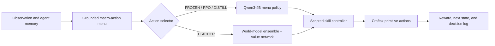

# LLM Priors vs. Learned World Models in Craftax

## Overview

This project asks a practical agent-learning question:

> **Given only 3,200 environment decisions, what does a pretrained LLM learn through PPO, what does a structured world model learn from interaction, and can distillation combine their complementary strengths?**

I built a common Craftax harness and compared four agent systems:

| System | Method | Training interactions | Role |
|---|---|---:|---|
| **FROZEN** | Qwen3-4B ranks grounded actions without training | 0 | Pretrained-policy reference |
| **PPO** | The same LLM fine-tuned with semi-Markov PPO + GAE | 3,200 | Standard model-free RL baseline |
| **TEACHER** | Randomly initialized structured world-model ensemble + value network | 3,200 | Model-based planner with no LLM prior |
| **DISTILL** | Teacher policy distilled into Qwen3-4B | Inherits 3,600 teacher decisions; no new interactions | Fast deployable policy |

The primary matched-interaction comparison is **PPO versus TEACHER**. FROZEN is a no-training reference. DISTILL is reported separately because it inherits the teacher's data after an additional 400-decision dungeon-adaptation stage.

## Headline results

On 60 paired surface worlds:

| System | Reward | Achievements | Survival |
|---|---:|---:|---:|
| **TEACHER** | **10.61** | **10.6** | **90%** |
| PPO | 7.66 | 8.5 | 52% |
| FROZEN | 7.29 | 8.1 | 48% |

The TEACHER exceeded FROZEN by **+3.32 reward** under paired evaluation ($p<0.001$). A second independently initialized teacher reproduced the result with **11.75 reward, 11.9 achievements, and 90% survival**.

Under the same 3,200-decision budget, PPO showed **no detectable improvement** over FROZEN ($+0.36$ reward, $p=0.22$). This is a result for the current model, action interface, training setup, and budget—not a general claim that PPO cannot learn Craftax.

### The systems learned complementary knowledge

- **The pretrained LLM knew the long crafting chain.** It reached iron in 14 of 60 worlds without environment training.
- **The LLM largely missed Craftax-specific thirst.** FROZEN and PPO frequently died of dehydration.
- **The world-model planner learned survival and broad surface competence.** It reached 90% survival, but did not discover the long sequence required to reach iron on the surface.
- **After 400 floor-1 decisions, the teacher adapted rapidly.** Its dungeon reward increased from **4.81 to 13.46**, and it learned coal, furnaces, torches, bows, potions, iron, and diamond behavior.
- **Distillation transferred survival into the LLM without new interactions.** The distilled policy reached **9.75 reward**, survived **53/60 worlds**, and had **zero dehydration deaths**. It also revealed a tradeoff: more decisions spent on upkeep reduced some deep crafting progress, and one unsafe dungeon sleeping habit transferred with the teacher.

The main conclusion is not that one system dominates everywhere:

> **Pretrained semantic knowledge and environment-grounded model learning produce different competence, different blind spots, and different transfer failures.**

## Agent architecture

All systems use the same hierarchical interface:



At each planner decision, the harness constructs up to 20 feasible macro-actions such as:

```text
go_to(tree)
craft(stone_pickaxe)
fight(zombie)
drink_water
open_chest
descend
```

A scripted controller executes the selected macro-action over a variable number of primitive game steps.

### Grounded action contract

The menu follows two rules:

1. **Offered means executable.** Impossible crafts, unreachable targets, and zero-step survival actions are filtered out.
2. **Availability is not value.** A visible chest may create an `open_chest` option, but the menu does not tell the agent whether opening it is useful.

The constructor reads only the agent's observation and map memory. It shares grounding predicates with the executor, and every data file records the action-menu version.

### Semi-Markov time accounting

Macro-actions have different durations. A fight may take three primitive steps; navigation may take forty. The project therefore discounts by elapsed primitive game time rather than once per planner decision.

For macro-action duration $\tau_t$:

$$
R_t^{\mathrm{macro}}=\sum_{j=0}^{\tau_t-1}\gamma^j r_{t,j}.
$$

The same duration-aware accounting is used by PPO, GAE, value fitting, and model-based action scoring.

## The learning systems

### PPO: LLM actor with duration-aware GAE

Qwen3-4B defines a categorical policy over the full grounded menu. Each candidate string is scored by its length-normalized average token log-probability, divided by a calibrated temperature, and normalized across candidates.

PPO uses one scalar probability ratio for the sampled menu action. The ratio includes the same $\varepsilon=0.05$ exploration mixture used during collection. GAE uses primitive-time discounting and correctly distinguishes true death from rollout truncation.

### TEACHER: structured model-based planning

The TEACHER has no LLM. A three-member bootstrap ensemble predicts, for each state-action pair:

- the next 132-feature structured state;
- immediate reward;
- action duration;
- death probability;
- achievement and interaction events.

Typed output heads use losses appropriate to counts, binary variables, categories, and continuous quantities. A separate value network estimates continuation value.

During collection, one ensemble member is sampled per episode for coherent Thompson-style exploration. During evaluation, the planner uses a pessimistic score based on ensemble mean minus uncertainty.

A key design is **rare-event shrinkage**: per-achievement predictions borrow strength from a pooled “any achievement” estimate when data is scarce, then rely increasingly on their own evidence as counts grow. This single change improved reward by approximately 3.3 points.

### DISTILL: transfer the planning policy into the LLM

The teacher and LLM rank the same menus, so teacher logs provide supervised targets without additional environment interaction. Distillation uses:

- a soft teacher distribution over menu actions;
- a prior-based trust region toward the base LLM;
- a confidence gate that suppresses uncertain teacher labels;
- a KL anchor that protects the pretrained policy where the teacher has weak evidence.

The result is a single-forward-pass LLM policy that retains much of the teacher's survival behavior, while exposing measurable interference and opportunity-cost tradeoffs.

## Experimental discipline

The evaluation infrastructure is a major part of the project:

- **Paired worlds:** every system plays the same seeds.
- **Paired bootstrap:** confidence intervals and two-sided $p$-values use 10,000 paired resamples.
- **Minimum detectable effect:** every comparison reports what effect size the evaluation had enough power to detect.
- **Pre-registered predictions:** expected outcomes and refutation branches are written into experiment drivers before runs.
- **Budget accounting from logs:** interaction counts come from each run's recorded decisions, not intended configuration.
- **Gated correctness checks:** menu feasibility, reward assembly, GAE, gradients, evaluator consistency, and policy definitions are tested before expensive runs.
- **Held-out test set:** 80 worlds remain untouched for one final evaluation.

Several apparent findings from early 10-world evaluations disappeared at 60 worlds. Those negative results are retained in the report rather than removed.

## Limitations

- Current headline numbers are development-set results; the final test set remains untouched.
- The teacher has two training seeds; PPO and distillation currently have one each.
- The study uses one game, one LLM size, and 40-decision evaluation episodes.
- The grounded action menu and scripted skills do substantial work; this is not raw-token or primitive-control RL.
- Most training so far occurs on the surface. Floor-1 experiments study near-zero-shot behavior and few-shot adaptation, not full multi-floor training.
- Floor-1 adaptation data and evaluation states are not yet separated into a strict held-out adaptation protocol.

## Roadmap

- [x] Build a verified hierarchical Craftax harness and common action interface.
- [x] Implement duration-aware PPO + GAE for an LLM actor.
- [x] Train and replicate a structured model-based planner.
- [x] Evaluate near-zero-shot floor transfer and 400-decision dungeon adaptation.
- [x] Distill the model-based policy into Qwen3-4B and measure interference.
- [ ] Run the untouched 80-world test set once.
- [ ] Train through deeper floors with a saved-state curriculum.
- [ ] Study long-horizon counterfactual credit assignment using exact simulator branching.

The planned credit-assignment extension will compare standard duration-aware GAE with intervention-supervised counterfactual credit while holding the LLM actor, PPO optimizer, action interface, and initialization fixed.

## Documentation

- [`docs/PROJECT_REPORT.md`](docs/PROJECT_REPORT.md) — accessible research narrative, results, ablations, and limitations.
- [`docs/TECHNICAL_APPENDIX.md`](docs/TECHNICAL_APPENDIX.md) — exact action-menu contract, world-model architecture, semi-Markov PPO formulation, exploration-mixture correction, and distillation losses.

## What's in the repo

```
harness/        Craftax as a text game: a renderer verified against the native
                observation, real fog of war, 17 scripted skills, and the grounded
                menu constructor that defines the shared action space
models/         the world model: typed prediction heads, the ensemble, the reward
                head with achievement masking and shrinkage, and the value network
planner/        the world-model planner ("teacher") — Thompson sampling to explore,
                pessimistic scoring to act
rl/             semi-Markov returns and GAE (discounting by elapsed game time, not by
                decision count), the PPO core, and the budget ledger — all unit-tested
                against hand-computed references
data/*.py       feature builder, transition schema, and target construction
                (the .py files; collected rollouts are not published — see below)
exploration/    the snapshot bank: exact save/restore of game state, RNG and agent
                memory, which is what makes branch-and-replay possible
counterfactual/ branch-replay machinery for the long-horizon credit-assignment stage
eval/           paired-bootstrap statistics and the single shared evaluator
scripts/        drivers for every experiment, the gate scripts, and the verdict and
                audit tools
configs/        the frozen hyperparameters for the world model, PPO and distillation
```

Collected rollouts and model checkpoints are **not** in the repo.
Everything they contain is regenerable from the drivers, and every finding derived
from them lives in the reports.

---

**Project theme:** model-free RL, model-based planning, policy distillation, sample-efficient adaptation, and long-horizon agent evaluation.
